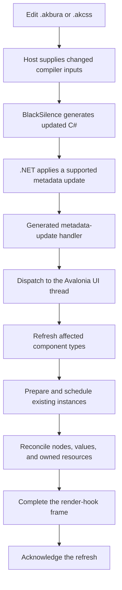
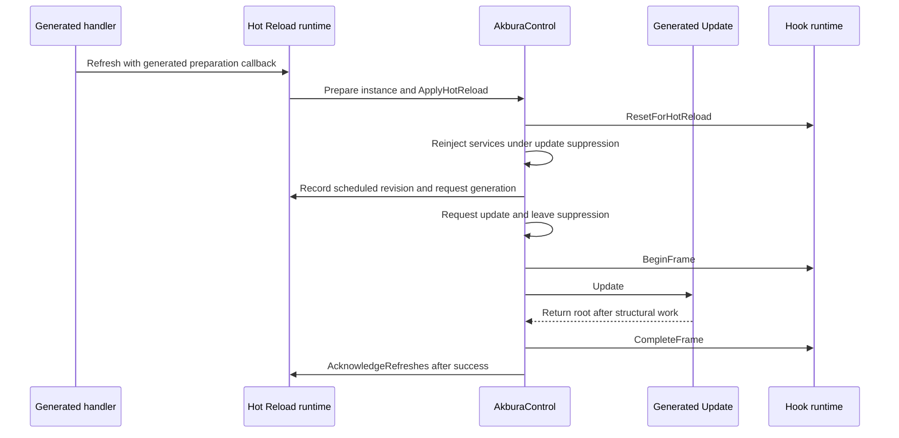
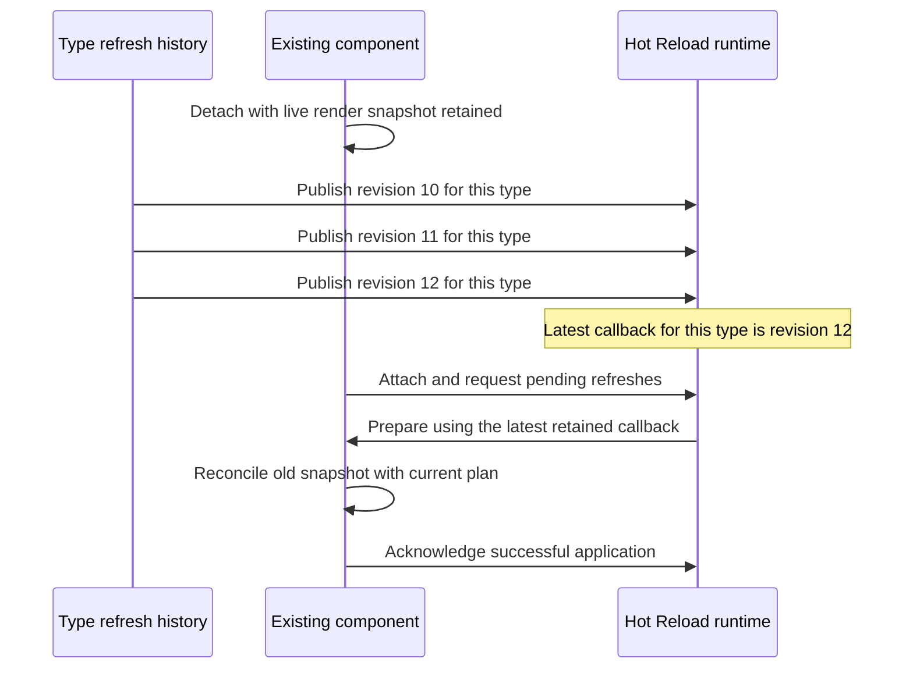
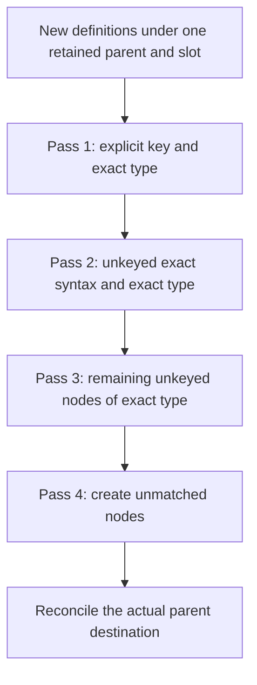
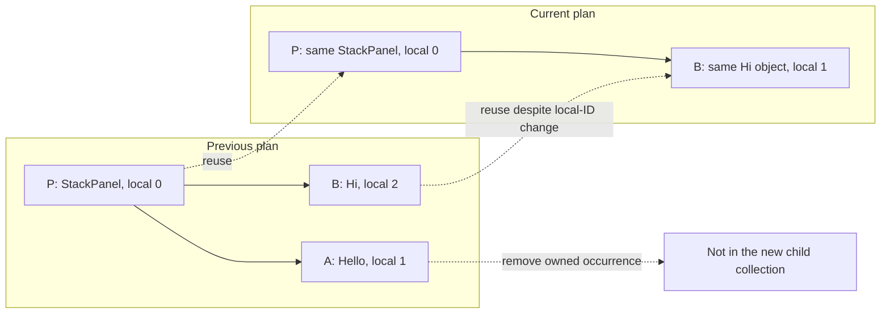
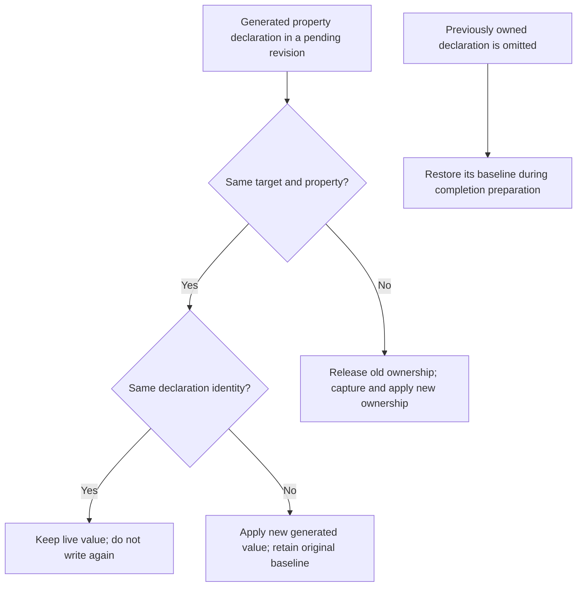
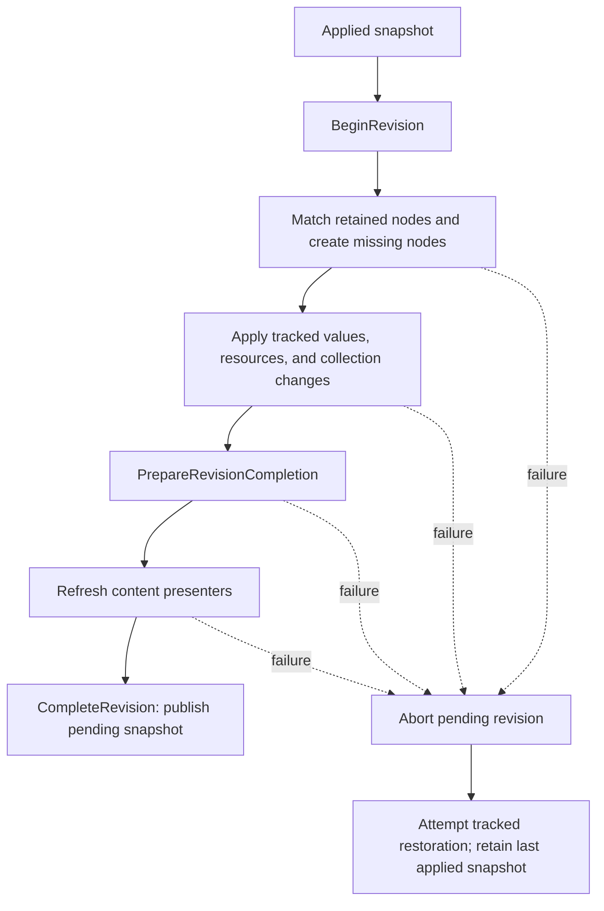
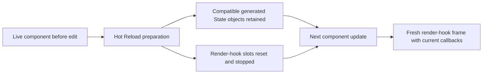

# How Hot Reload Works

Akbura Hot Reload updates a running component without unconditionally replacing its control tree. The generator produces an update-friendly C# contract, .NET applies the supported code changes, and Akbura reconciles the new declarations with the objects already in memory.

The central idea is:

> Update the generated instructions, preserve compatible live objects, and explicitly reconcile the resources and values owned by those instructions.

This guide explains the implementation for contributors working on the generator, runtime, or tests. In particular, it includes the render-hook reset and lifecycle changes in that revision. The examples are explanations of the implementation, not a promise that every illustrated source edit is accepted by every .NET Hot Reload host.

Diagrams use Mermaid and are embedded directly in this Markdown file. GitHub can render these fenced blocks without separate image assets. See [GitHub's diagram documentation][mermaid-docs] for renderer details.

## Contents

- [1. The two layers of Hot Reload](#1-the-two-layers-of-hot-reload)
- [2. Why Debug generates a different control representation](#2-why-debug-generates-a-different-control-representation)
- [3. From a metadata update to a component refresh](#3-from-a-metadata-update-to-a-component-refresh)
- [4. Descriptor and state preparation](#4-descriptor-and-state-preparation)
- [5. Refresh revisions, scheduling, and acknowledgment](#5-refresh-revisions-scheduling-and-acknowledgment)
- [6. The structural render plan](#6-the-structural-render-plan)
- [7. How old and new nodes are matched](#7-how-old-and-new-nodes-are-matched)
- [8. Worked example: inserting and removing children](#8-worked-example-inserting-and-removing-children)
- [9. Property values and declaration ownership](#9-property-values-and-declaration-ownership)
- [10. Collection reconciliation](#10-collection-reconciliation)
- [11. Bindings, events, and AKCSS](#11-bindings-events-and-akcss)
- [12. Structural completion and rollback](#12-structural-completion-and-rollback)
- [13. Render hooks during Hot Reload](#13-render-hooks-during-hot-reload)
- [14. An end-to-end edit](#14-an-end-to-end-edit)
- [15. Supported scope and important boundaries](#15-supported-scope-and-important-boundaries)
- [16. Debugging a failed refresh](#16-debugging-a-failed-refresh)
- [17. Tests contributors should add](#17-tests-contributors-should-add)
- [18. Source map and contributor checklist](#18-source-map-and-contributor-checklist)

## 1. The two layers of Hot Reload

There are two separate mechanisms involved.

**.NET Hot Reload changes executable code and metadata.** The development host detects changes, obtains updated compilation output, and applies the edits supported by its runtime and debugger. Akbura's generated code participates in that process.

**Akbura Hot Reload updates existing component instances.** After the metadata update, Akbura refreshes generated descriptors, schedules affected components, reconciles their render trees, and rebuilds their render-hook frames.

Akbura's runtime is not a second parser that reads a modified `.akbura` file. The new instructions arrive as updated generated C# methods and data. The source generator reads `.akbura` and `.akcss` through Roslyn's additional-text pipeline; the runtime consumes the resulting contract.



A source edit can therefore fail at different layers. A compilation error or unsupported metadata edit prevents the new code from reaching Akbura's runtime. A reconciliation or effect failure happens later, after updated code has arrived. Diagnosing one as the other leads to fixes in the wrong subsystem.

**Read:** [the incremental generator][generator], [the generated update handler writer][handler], and [the .NET metadata-update handler contract][metadata-docs].

## 2. Why Debug generates a different control representation

The generator selects `ComponentGenerationMode.DebugStructural` when the consuming C# parse options contain the `DEBUG` preprocessor symbol. Otherwise, it selects `ReleaseDirect`. The selection is based on the symbol, not merely on a configuration's display name.

In the direct representation, generated code can use ordinary fields and direct element references. That is convenient for normal execution, but tying each element to a separate CLR field makes structural source edits change the component's metadata shape.

The structural representation instead places eagerly created component-scope elements in an `AkburaRenderState`. The component contains a stable runtime-store field, and generated expressions retrieve the current objects through local identifiers.

The important generated members are:

| Member | Responsibility |
| --- | --- |
| `__akburaRenderState` | Retains live objects and the last applied structural snapshot. |
| `__AkburaCurrentRenderRevision()` | Returns the current render-plan fingerprint. |
| `__AkburaDescribeRenderTree(...)` | Describes the current nodes and their structural relationships. |
| `__AkburaCreateRenderNode(int)` | Constructs a missing node for a current-plan identifier. |
| `__AkburaEnsureRenderTree()` | Starts reconciliation when the plan is different or was invalidated. |

For example, this is a simplified generated-code excerpt, with qualification and attributes omitted:

```csharp
private readonly AkburaRenderState __akburaRenderState = new();

private static object __AkburaCreateRenderNode(int localId)
{
    return localId switch
    {
        0 => new StackPanel(),
        1 => new TextBlock(),
        2 => new Button(),
        _ => throw new ArgumentOutOfRangeException(nameof(localId)),
    };
}

private bool __AkburaEnsureRenderTree()
{
    return __akburaRenderState.BeginRevision(
        __AkburaCurrentRenderRevision(),
        __AkburaDescribeRenderTree,
        __AkburaCreateRenderNode);
}
```

The factory describes how to create an object **when no old object can be reused**. It does not recreate every object on every update. Generated access to an existing element uses expressions such as:

```csharp
var button = __akburaRenderState.GetRequired<Button>(2);
```

Adding an unnamed eager child can now change the description and factory method bodies without requiring another per-element field. Existing `x.Name` elements receive typed accessors backed by the runtime store.

This is a targeted metadata-stability strategy, not a guarantee that arbitrary source edits preserve CLR shape. Adding named members, changing state declarations, or changing compiler-generated closure shapes can still involve metadata changes outside that strategy. The emitted-metadata tests are important precisely because stable-looking generated source alone is not enough.

**Read:** [mode selection][generator], [structural code generation][structural-writer], and [metadata-contract tests][metadata-tests].

## 3. From a metadata update to a component refresh

`HotReloadServiceWriter` generates `Akbura.HotReloadService.g.cs`. Under `#if DEBUG`, that file registers an assembly-specific handler through `MetadataUpdateHandlerAttribute`.

The handler has the two .NET callbacks:

```csharp
internal static void ClearCache(Type[]? updatedTypes)
internal static void UpdateApplication(Type[]? updatedTypes)
```

At the inspected revision, Akbura's generated `ClearCache` is empty. The actual refresh work begins in `UpdateApplication`. The .NET contract calls cache-clearing callbacks before application-update callbacks; Akbura performs its generated descriptor reconciliation in the application-update path.

### UI-thread handoff

`UpdateApplication` checks `Dispatcher.UIThread.CheckAccess()`. On the UI thread, it runs `UpdateApplicationCore` immediately. Otherwise, it posts that work to the UI dispatcher.

Posting the callback is not the same as completing a refresh. The component's successful-update acknowledgment happens substantially later.

### Selecting affected types

`UpdateApplicationCore` has two paths:

| Input | Selection |
| --- | --- |
| `updatedTypes` is `null` | Refresh every generated component known to this handler. |
| The generated handler itself is included | Refresh every known component, using the current generated list. |
| A concrete type list is supplied | Select affected component types and consumers of affected generated AKCSS modules. |

The generated `Affects` helper checks the updated type and walks its `DeclaringType` chain. It also checks whether that type is assignable from a candidate component type. This accounts for updates reported against nested types and for affected base types.

The resulting component types are ordered with base types first. The handler then calls each selected component's generated `__AkburaHotReloadApply()` method. Failures are collected so that one component type does not prevent attempts to refresh the others.

This is not a general dependency graph for arbitrary helper methods. A change in an unrelated service or utility type should not automatically be assumed to invalidate every component that calls it.

**Read:** [handler generation and filtering][handler].

## 4. Descriptor and state preparation

`__AkburaHotReloadApply()` separates three concerns: generated descriptor shape, generated state shape, and instance render preparation.

A *shape* is a fingerprint computed by the generator. It describes the relevant declaration contract; it is not a snapshot of the live values currently held by a component.

### Descriptor shape

Descriptors include parameters, injected services, and commands. Their stable keys incorporate semantic identity rather than source position. For example, a parameter key includes its name, type, and property kind; a service key includes its name and type; a command key includes its signature.

The descriptor fingerprint contains additional details that can affect a descriptor's behavior, including parameter flags and default-value syntax.

When the descriptor shape changes, generated code:

1. Saves the previous property manifest and computes the current descriptor keys.
2. Removes obsolete generated Avalonia property registrations.
3. Reuses compatible property objects through `FindProperty<TProperty>()`, creates replacements where needed, and rebuilds descriptor arrays.
4. Publishes the current manifest and applied descriptor-shape fingerprint.

Preserving a compatible Avalonia property object's identity matters because existing instances may already hold values associated with that property. Descriptor changes should not unnecessarily create a second property identity for the same compatible declaration.

`AvaloniaPropertyRegistryHotReload` isolates the compatibility-sensitive part. It accesses Avalonia's registry maps and caches through reflection, removes obsolete registrations for the specific owner, and clears the relevant caches. A private-field layout mismatch produces a `NotSupportedException`, not an attempted silent fallback.

> **Contributor rule:** An Avalonia dependency upgrade must be checked against this registry adapter. Do not replace targeted unregistering with a blanket removal of all properties belonging to a component.

### State shape

State identity is based on the state name, value type, and factory kind: a value initializer and a state-producing hook are different contracts. The state fingerprint is built from the ordered state keys. It does **not** include the initializer expression.

This distinction is deliberate. Changing:

```akbura
state int count = 0;
```

into:

```akbura
state int count = 100;
```

does not overwrite an already-created compatible `State<int>` object with `100`.

Generated state access is lazy, conceptually:

```csharp
private State<int>? _countState;

private State<int> CountState =>
    _countState ??= CreateState(s_countInfo);
```

The real member names include generated identity information. The important behavior is the `??=`: an existing compatible field keeps its `State<T>` instance and current value.

When the state shape changes, `__AkburaHotReloadRebuildStateInfos()` recreates the static state descriptions, and the instance preparation callback clears `__states` so the cached state list can be rebuilt.

> **Important:** Despite its name, `__AkburaHotReloadResetStates()` does not clear every individual state field. It clears the cached list. Compatible state objects can survive; new or incompatible identities do not receive automatic value migration.

Renaming a state or changing its type is therefore different from editing its initializer. Such changes also remain subject to the host's ability to apply the resulting CLR metadata edits.

### Instance preparation

In structural mode, the ordinary preparation callback calls:

```csharp
__component.__akburaRenderState.Invalidate();
```

Invalidation clears the applied render fingerprint but retains the live-node snapshot. The next update must reconsider the current plan even if its local fingerprint has not changed, which is useful for changes outside the element's own markup.

The generator also contains a direct-mode preparation path that reapplies generated initial values. Do not confuse that path with the structural mode selected for a normal `DEBUG` compilation.

**Read:** [component Hot Reload generation][component-hot-reload], [identity generation][identity], [state generation][state-writer], and [the registry adapter][registry-adapter].

## 5. Refresh revisions, scheduling, and acknowledgment

`AkburaHotReloadRuntime` coordinates instance refreshes. It does not use one boolean saying that a component is up to date.

### Different identifiers answer different questions

| Identifier | Question it answers |
| --- | --- |
| Descriptor/state fingerprint | Did this generated declaration contract change? |
| Render fingerprint | Is this the same generated structural plan? |
| Global refresh revision | Which published type refresh is newer? |
| Component creation revision | Which refreshes predate this instance? |
| Per-component request generation | Which scheduled update completed successfully? |
| Plan `LocalId` | Where is a node in the current description? |
| Runtime `NodeId` | Which retained live node is this across descriptions? |

These identities must not be substituted for one another. A render fingerprint does not prove that effects completed, and a local identifier is not a stable cross-edit node identity.

### Tracking instances without retaining them forever

`AkburaComponentRegistry` tracks participating attached components through weak references. Excluded top-level windows do not participate; the diagnostics window uses this mechanism.

The Hot Reload runtime keeps per-instance applied and scheduled revisions in a `ConditionalWeakTable`. Separately, it retains the **latest preparation callback per component type** so an older detached instance can catch up later.

The type-level callback should not capture a particular component instance. Otherwise, a callback intended to describe how to refresh a type could accidentally keep an instance alive.

### The attached-instance path

For a matching participating component, the runtime invokes any required preparation callbacks and calls `AkburaControl.ApplyHotReload`.

That method suppresses component updates while it resets render hooks, reinjects services, records a new request generation, and requests an update. Suppression prevents an intermediate state change from running the update before preparation has finished.



Acknowledgment happens only after `Update()` returns, `Child` is assigned, and the hook frame completes. The runtime moves eligible scheduled revisions into the applied-revision map at that point.

If an update fails, the request generation is retained as pending. Later update processing or another refresh attempt can retry it. A scheduled refresh is not falsely recorded as applied merely because its preparation callback ran.

Reentrant refresh requests are handled through `IsApplying` and `NeedsDrain`; they request another drain rather than recursively running the same refresh application. This is separate from `AkburaControl`'s nonrecursive update loop and its `MaxUpdatesPerBatch` guard.

### Detached-instance catch-up

A component records the currently published revision when it is created. An older instance that is detached when a refresh occurs is not refreshed through the attached-component registry. On its next participating attach, it is checked against newer applicable revisions.

Only the newest callback for a given component type is retained. Missed structural revisions are coalesced, not replayed one by one.



An instance created after a refresh's publication starts with that creation baseline; it does not need to replay the preceding history. Multiple applicable type refreshes, such as base and derived component refreshes, still have their own revision bookkeeping.

**Read:** [refresh coordination][hot-reload-runtime], [the component registry][component-registry], and [component update integration][control].

## 6. The structural render plan

`AkburaRenderNodeDefinition` describes a node using six pieces of information:

| Field | Meaning |
| --- | --- |
| `LocalId` | Dense identifier in the current plan, starting at zero. |
| `ParentId` | Current-plan parent; the root uses `-1`. |
| `Slot` | Semantic destination under the parent, such as a collection or scalar property. |
| `Type` | Exact runtime type expected from the factory. |
| `ExplicitKey` | Optional source identity; currently derived from `x.Name`. |
| `SyntaxIdentity` | Hash of the node's own normalized declaration. |

The plan builder requires one root, dense identifiers, and parents appearing before their children. Duplicate explicit keys within the same parent and slot are rejected.

The slot is not just an arbitrary child index. For example, a parent's content property and its children collection are different destinations. Matching must not transfer an object between unrelated properties merely because the object's type happens to match.

### What the syntax identity includes

`ComponentHotReloadIdentity.CreateRenderSyntaxIdentity()` hashes the start tag and non-element body content. Nested element declarations are excluded from their parent's own identity.

Consequently, inserting a child does not automatically make the parent's own declaration appear changed. This helps preserve a parent's live values when only its descendants are edited.

Normalization uses token kinds and token values, excluding trivia. This is not a rule that every whitespace change is irrelevant: meaningful markup text remains part of the token content.

On an ordinary update, `BeginRevision()` returns `false` when the current fingerprint already matches. The generated component can still evaluate dynamic expressions and register render hooks without reconstructing the structural description on every state change.

**Read:** [the plan builder][plan-builder], [the structural writer][structural-writer], and [syntax and slot identities][identity].

## 7. How old and new nodes are matched

Matching runs within a group identified by a **retained parent node identity and a semantic slot**. The runtime processes parents before children so it can determine the correct old sibling group for each new parent.

For each group, `MatchGroup()` performs four passes in order:



### Pass 1: explicit identity

An explicitly keyed node matches an old node with the same key and exact type. At this revision, the generator derives the key from `x.Name`:

```akbura
<TextBox x.Name="query" Text="Search" />
```

Keyed nodes do not fall back to unkeyed matching when their key changes. A renamed key is therefore an identity change, not merely a cosmetic rename from the reconciler's perspective.

Keys are scoped to the parent and slot. `x.Name` is not a global command to move a live control between arbitrary parents. Replacing a parent can prevent its old descendants from being candidates for reuse under the new parent.

### Pass 2: exact declaration matching

For unkeyed nodes, the runtime first looks for the same exact type and syntax identity. When several old candidates have identical declarations, it chooses the closest sibling position, using the earlier old position to break a tie.

This pass is what lets an unchanged later sibling survive the removal of an earlier sibling of the same type.

### Pass 3: type fallback

Remaining unkeyed nodes match remaining old nodes of the same exact type in old sibling order. This lets an edited declaration reuse an object even though its syntax hash changed.

Despite the method name `MatchCompatibleTypes`, the implementation requires type equality, not general assignability. A different derived type is not interchangeable with the original runtime type.

### Pass 4: construction

Unmatched nodes are created by the current factory and receive new runtime `NodeId` values. The runtime rejects a null result, an unexpected concrete type, or one object reused for multiple nodes. New objects implementing `ISupportInitialize` are tracked through their initialization lifecycle.

Reused nodes retain both their CLR object reference and their runtime `NodeId`. Their current `LocalId` can be different.

> **Identity limit:** Two identical unkeyed siblings do not contain enough information to recover an author's intended business identity after arbitrary edits. The implementation makes a deterministic choice; it does not infer invisible identities. Use an existing explicit name where identity matters, and test ambiguous cases rather than assuming perfect preservation.

**Read:** `MatchGroup`, `MatchExplicitKeys`, `MatchExactSyntax`, `MatchCompatibleTypes`, and `CreateUnmatchedNodes` in [the render state][render-state], plus [planner key selection][planner].

## 8. Worked example: inserting and removing children

Start with:

```akbura
using Avalonia.Controls;

<StackPanel>
    <TextBlock Text="Hello" />
    <TextBlock Text="Hi" />
</StackPanel>
```

For illustration, assign the live objects the runtime identities `P`, `A`, and `B`. These letters stand for actual `NodeId` values; they are not keys supplied by the source.

Now remove the first `TextBlock`:

```akbura
using Avalonia.Controls;

<StackPanel>
    <TextBlock Text="Hi" />
</StackPanel>
```

| Object | Old local ID | New local ID | Result |
| --- | ---: | ---: | --- |
| StackPanel `P` | 0 | 0 | Reused. |
| TextBlock `A`, `Text="Hello"` | 1 | — | No longer owned by the new child collection. |
| TextBlock `B`, `Text="Hi"` | 2 | 1 | Reused through exact syntax matching. |



The runtime does not decide that “local ID 1 survived, so it must be the first old text block.” The exact syntax match for `Hi` is considered before type-only fallback.

The inverse case is similar. Adding a previously absent `TextBlock Text="Hi"` after `Hello` preserves the old `Hello` object and constructs only the missing child. The collection reconciler inserts the new object without clearing the whole collection.

A changed literal is a different case. Changing the only unkeyed child from `Text="Hello"` to `Text="Welcome"` can reuse it through the exact-type fallback, then update the changed property declaration.

**Read:** [node matching][render-state] and [generated integration tests][integration-tests].

## 9. Property values and declaration ownership

Preserving an object reference is not enough. Reapplying every generated assignment to that same object would still destroy user-entered values.

The runtime therefore tracks declaration ownership at the property level. A retained node can have a changed start tag while only one of its property declarations actually needs to be reapplied.

Consider:

```akbura
<TextBox Text="Generated" Width="100" />
```

The user types `User value`. The source is then changed to:

```akbura
<TextBox Text="Generated" Width="200" />
```

The expected result is the **same TextBox**, with `Width` updated to `200` and live `Text` still equal to `User value`. The integration suite contains this scenario.

`ReconcileClrValue` and `ReconcileAvaloniaValue` record the generated declaration, its target, and its baseline. When the target and property still match, an unchanged declaration retains the previous property state without writing the generated value again.



### Baseline versus current value

The baseline is the value or property state associated with the ownership mechanism before the generated declaration took control. It is not necessarily the latest value written by application code.

Removing an owned declaration releases that ownership and restores the recorded baseline. It should not simply leave the last generated value in place forever. Changing the declaration repeatedly should not make each intermediate generated value the new original baseline.

This preservation rule applies to declarations routed through the reconciliation API. It is not a blanket promise that an arbitrary dynamic expression or user callback will stop assigning a property during normal updates.

Scalar child properties, such as a `Border`'s child, are tracked too. Their omission can remove a child while preserving the parent instance.

**Read:** property reconciliation in [the render state][render-state] and the value-preservation cases in [integration tests][integration-tests].

## 10. Collection reconciliation

`AkburaRenderCollectionReconciler` synchronizes the generated portion of a collection. It does not assume that Akbura owns every item in that collection.

The reconciler receives the live collection, the previous generated items, the desired generated items, and an insertion anchor. It locates the previous **owned occurrences**, then moves or inserts desired items and removes obsolete owned occurrences.

For example, where `External` is not generated:

```text
Live before:        [External, A, B]
Previously owned:   [A, B]
Desired generated:  [B, C]
Live after:         [External, B, C]
```

The external item survives. Retained reference-type items are identified by reference, not by an overridden `Equals` method. Value-type collections use value equality.

For movable Avalonia collections, the implementation uses a native move when available. Otherwise, a move can fall back to removal followed by insertion. Do not equate a fallback move with constructing a new item, or assume it has identical notification behavior to a native move.

The insertion anchor also matters when the generated segment becomes empty and later receives new children. Without retained placement information, subsequent insertion could drift to an unrelated position in a mixed-ownership collection.

There are explicit failure conditions. A read-only collection cannot be reconciled. If a previously owned occurrence was removed outside the reconciler and cannot be found, the runtime reports an ownership violation instead of silently claiming the resulting collection is consistent.

`ReconcileComponentCollection` adds logical-child synchronization for collection content owned by an Akbura component. Updating the backing list alone is insufficient if the component's logical tree still describes the old children. The structural runtime tracks the corresponding collection mutations for rollback.

**Read:** [collection reconciliation][collections] and collection ownership in [the render state][render-state].

## 11. Bindings, events, and AKCSS

Some generated operations own active resources rather than simple values. An event handler, for example, must be detached when its declaration disappears; merely ceasing to generate another `+=` does not remove the old subscription.

The structural runtime distinguishes ordinary operation registration from owned operations:

```text
ShouldApplyOperation
    Register and compare a declaration.

ShouldApplyOwnedOperation
    Register and compare a resource-owning declaration.

Apply...Operation
    Install the corresponding resource with replacement and rollback tracking.
```

The operation slot identifies the semantic destination on a retained node. The declaration identity describes the current source operation at that destination. These two identities have different purposes.

| Resource | Runtime handling |
| --- | --- |
| Avalonia binding | Applied through `ApplyBindingOperation`, with previous ownership released or restored as required. |
| Observable binding | Applied through `ApplyObservableBindingOperation`. |
| CLR event | Applied through `ApplyClrEventOperation`. |
| Routed event | Applied through `ApplyRoutedEventOperation`. |
| Generated AKCSS cascade | Applied through `ApplyAkcssStylesOperation`. |

An unchanged operation can retain its resource. A replacement releases the previous resource and installs the new one. An omitted operation is released during completion preparation. The pending revision tracks mutations so a failed structural application can attempt to restore the old resource state.

A property value and an owned operation cannot both claim the same node slot in one pending revision. Transitions such as “literal value becomes a binding” must explicitly release the previous kind of ownership.

### Why AKCSS is refreshed even when markup is unchanged

AKCSS is intentionally different: the generated cascade is replaced for **every structural revision**. A referenced style module can change while an element's own markup and syntax identity remain identical.

Two mechanisms work together: the generated handler knows which AKCSS module types affect a component, and instance preparation invalidates its render state. The next structural revision then replaces the cascade instead of incorrectly deciding that unchanged local markup means unchanged styling.

The implicit root DataContext binding is also tracked as an owned operation. Infrastructure-generated bindings need the same lifecycle discipline as bindings written explicitly in markup.

**Read:** owned operations in [the render state][render-state], [handler AKCSS filtering][handler], and [generated root binding logic][lifecycle-writer].

## 12. Structural completion and rollback

A structural update has an applied snapshot and a separate pending revision. `Invalidate()` does not discard the live snapshot; `BeginRevision()` uses it as the basis for the next reconciliation.

The generated lifecycle follows this outline:

```text
Ensure the current render tree
    If the applied revision is current, no structural revision is opened.

Inside the generated update:
    Register render statements.
    Apply structural initial-value work when a revision is pending.
    Evaluate ordinary update work.
    Prepare structural completion when a revision is pending.
    Refresh component content presenters.
    Complete the structural revision when one is pending.
    Return the root.

On failure while a revision is pending:
    Abort the pending structural revision.
    Preserve the original exception, including rollback failures if any.
```



### Preparation is not publication

`PrepareRevisionCompletion()` validates owned operations, removes omitted properties, collections, and operations, and finishes initialization of newly created nodes. It marks the pending revision as prepared but does not publish it as the applied snapshot.

This ordering allows content-presenter refreshes to happen after completion-time changes while still being inside the structural rollback boundary.

`CompleteRevision()` publishes the pending nodes, collections, properties, and fingerprint. Only then is the pending revision cleared as successfully applied.

### What rollback means here

Tracked mutations give the runtime a way to restore collections, owned properties, and resource state after failure. Rollback can itself fail; the implementation combines those failures with the original exception rather than pretending restoration succeeded.

This is not a transaction over the entire application. It does not undo arbitrary user side effects, already-executed callbacks, or every ordinary dynamic assignment. Static descriptor preparation is also outside this per-instance structural transaction.

Most importantly, structural publication happens **inside generated `Update()`**. Hook completion and Hot Reload acknowledgment happen afterward in `AkburaControl`:

```text
Generated Update:
    Structural revision is completed.
    Root is returned.

AkburaControl:
    Child is assigned.
    Render-hook frame is completed.
    Scheduled refresh is acknowledged.
```

A hook failure can therefore leave an already-committed structural tree with an unacknowledged Hot Reload request. Do not describe these three boundaries as one all-or-nothing commit.

**Read:** [generated lifecycle ordering][lifecycle-writer], [render-state completion and abort][render-state], and [component acknowledgment][control].

## 13. Render hooks during Hot Reload

Render hooks normally use a positional frame. `UseHookRuntime` verifies the count, contract key, and runtime state type of registrations against the previous frame.

Hot Reload intentionally does not try to migrate that positional frame across source edits. `AkburaControl.ApplyHotReload()` calls `ResetForHotReload()` before service reinjection and the requested update.

The reset removes the old slot list from the active runtime state, attempts to stop every old slot, and lets the next completed frame create a new list. If reset is requested while a frame is being collected or completed, it is deferred until that operation reaches a safe boundary.



As a consequence, an effect with an empty dependency list runs again in the fresh Hot Reload frame. The new callback is not blocked merely because its old dependency list was empty. Adding or removing render hooks no longer requires matching the old slot count across a successful reset, although normal compilation and metadata-update restrictions still apply.

This policy does not make conditional hook calls valid during ordinary rendering. Between ordinary frames, the positional contract is still enforced.

### Detach is not Hot Reload

Detaching suspends render-hook application and stops active resources. Reattaching resumes the hook runtime and requests the appropriate restart or pending Hot Reload work. Unlike Hot Reload reset, detach can retain the slot state for later reuse.

The current implementation attempts cleanup across all slots and aggregates failures. `AkburaControl` also attempts component-parent cleanup and registry detachment even if hook cleanup fails.

### State hooks are a different lifetime

A state-producing hook used in a state initializer is not a render-hook slot merely because it has a `use...` name:

```akbura
state double width = useAvaloniaProperty(Width);
```

That state is accessed through the generated state-storage mechanism. Resetting render-hook slots is not equivalent to reconstructing every state initializer or disposing every object ever associated with a component.

**Read:** [the current hook runtime][hook-runtime], [Hot Reload integration][control], and [state generation][state-writer].

## 14. An end-to-end edit

Suppose this component is already running:

```akbura
using Avalonia.Controls;

state int count = 0;

<StackPanel>
    <TextBox x.Name="query" Text="Search" Width="180" />
    <Button Content="Run" />
</StackPanel>
```

The user has typed `Avalonia` into the TextBox. Existing application behavior has also changed `count` to `7`.

Now edit the component to:

```akbura
using Avalonia.Controls;

state int count = 100;

<StackPanel>
    <TextBlock Text="Find items" />
    <TextBox x.Name="query" Text="Search" Width="260" />
    <Button Content="Run" />
</StackPanel>
```

Assuming the host accepts the generated update, the intended path through the implementation is:

1. BlackSilence emits the updated factory, description, identities, and initializer method body; .NET applies the update and calls the generated handler.
2. The handler selects the component type. Its unchanged state key means the initializer edit does not reset the existing counter state.
3. Instance preparation invalidates the structural revision. `ApplyHotReload` resets render hooks, reinjects services, and requests an update under suppression.
4. The reconciler retains the StackPanel, finds `query` by explicit key and exact type, retains the unchanged Button, and creates the new TextBlock.
5. Property reconciliation applies the changed `Width` declaration. The unchanged `Text="Search"` declaration does not overwrite the user's live `Avalonia` value.
6. The collection receives the new first child. Generated lifecycle code prepares and completes the structural revision; the component then completes hooks and acknowledges the refresh.

The resulting state is:

| Item | Result |
| --- | --- |
| StackPanel | Same object. |
| Named TextBox | Same object. |
| TextBox text | `Avalonia`, because its generated text declaration did not change. |
| TextBox width | `260`, because that declaration changed. |
| Button | Same object. |
| New TextBlock | Newly constructed object. |
| Existing `count` state | Still `7`; changing the initializer does not replace an existing compatible state. |
| Render hooks, if present | Recreated for the new Hot Reload frame. |

Changing `Text="Search"` itself would be a different edit: the generated text declaration would then be new and could replace the live text. Preservation is based on unchanged declarations, not on a universal rule that user input always wins.

**Implementation basis:** [state identity][identity], [lazy state storage][state-writer], [matching and property ownership][render-state], and [hook reset][control].

## 15. Supported scope and important boundaries

The most useful guarantee is narrow and testable: compatible eager component-scope objects and unchanged owned declarations can survive a supported update.

| Boundary | Contributor implication |
| --- | --- |
| .NET metadata acceptance | A correct runtime reconciler cannot make a rejected CLR edit apply. Check the host before debugging node matching. |
| `DEBUG` selection | The structural representation depends on consuming parse options. Do not infer it solely from a folder or configuration label. |
| One structural root | Changing an existing single-root component to zero or multiple roots reaches an explicit restart guard. Keep a stable root container for structural-edit scenarios. |
| Deferred and template-local content | These are separate local scopes, not entries in the same eager component render store. Do not promise identity-preserving migration of all previously realized template instances. |
| Parent and slot boundaries | Reuse is local to a matched parent and semantic destination, not global reparenting by name. |
| Identical unkeyed siblings | Matching is deterministic but cannot recover an identity absent from the source. |
| State contract changes | Compatible fields can survive; renames, type changes, and factory-kind changes are not automatic value migrations. |
| Resource ownership | Only operations routed through ownership tracking receive its replacement and rollback behavior. Arbitrary subscriptions need their own lifecycle. |
| Multiple commit boundaries | Structural completion, hook completion, and scheduler acknowledgment are distinct. |
| Avalonia registry internals | Descriptor removal uses an isolated, version-sensitive reflection adapter. |
| Affected-type filtering | Arbitrary helper-code edits are not a universal component invalidation signal. |

The structural runtime contains deliberate validation rather than a universal “rebuild everything on any error” fallback. An ownership error should lead to understanding the invalid mutation, not to removing the check until the symptom disappears.

**Read:** [scope planning][planner], [root handling][lifecycle-writer], [matching validation][render-state], and [registry compatibility checks][registry-adapter].

## 16. Debugging a failed refresh

Debug in execution order. Establish where the update stopped before changing the next layer.

| Checkpoint | What to inspect |
| --- | --- |
| Compiler inputs and output | Did the changed additional text reach BlackSilence? Does the generated source reflect the edit? |
| Generation mode | Does the consuming compilation define `DEBUG`? Is the component using runtime storage? |
| Generated service | Is `Akbura.HotReloadService.g.cs` present with the metadata-update handler attribute? |
| Host update | Did .NET accept the update, or did the host report an unsupported edit or compilation failure? |
| Handler dispatch | Did `UpdateApplicationCore` run on the UI thread? Which `updatedTypes` were supplied? |
| Affected-type selection | Did the component or one of its known AKCSS modules satisfy the generated filter? |
| Participation | Is the instance attached and participating, or is its top-level excluded? |
| Preparation and scheduling | Was the render state invalidated? Is the latest revision prepared, merely scheduled, or acknowledged? |
| Structural reconciliation | Which parent/slot group was matched? What were the old and new keys, types, and syntax identities? |
| Property/resource ownership | Did the declaration change? Was an old owned collection occurrence removed externally? |
| Completion and hooks | Did structural preparation, content refresh, hook cleanup, or hook application throw? |

Useful breakpoint targets are `__AkburaHotReloadApply`, `ApplyPendingRefreshes`, `AkburaControl.ApplyHotReload`, `BeginRevision`, `MatchGroup`, `PrepareRevisionCompletion`, `CompleteRevision`, `UseHookRuntime.CompleteFrame`, and `AcknowledgeRefreshes`.

For an unexpectedly recreated control, inspect `ExplicitKey`, exact `Type`, retained parent `NodeId`, and `Slot` before looking at its local ID. For an unexpectedly overwritten value, inspect the specific property declaration identity, not just the node's identity.

For a refresh that appears stuck, compare scheduled revisions with acknowledged revisions and inspect the retained request generation. Do not mark a failed refresh as applied to suppress retries; that hides the failure and corrupts the scheduler's meaning.

A refresh failure does not imply that no other component was updated. Both the generated type loop and the attached-instance refresh loop attempt other entries and report collected failures afterward.

## 17. Tests contributors should add

Test observable behavior, generated representation, and failure recovery separately. A successful before/after string comparison does not prove that a real control kept its identity or that .NET can apply the emitted change.

### Runtime and integration scenarios

For a structural or ownership feature, cover the following cases where relevant:

| Area | Required observations |
| --- | --- |
| Insert/remove/reorder children | Reference identity of survivors, correct order, and absence of obsolete generated occurrences. |
| Change one constant | Changed property updates while another unchanged declaration preserves its live value. |
| Omit a property | Original baseline is restored through the appropriate ownership mechanism. |
| Replace/remove an event or binding | Old resource is released; repeated refreshes do not accumulate handlers or subscriptions. |
| Change AKCSS only | A consumer refreshes even when the element's own syntax is unchanged. |
| Mixed collection ownership | Unrelated items survive; insertion-anchor and empty-segment behavior remain correct. |
| Replace a scalar child | Parent identity and child relationships are correct. |
| Fail during a pending revision | Tracked state is restored where possible; the failure is not acknowledged as success. |
| Detach across several revisions | Latest applicable callback is used without replaying every intermediate revision. |
| Edit render hooks | Old slots stop, the next frame is rebuilt, and unchanged component state is not confused with hook state. |

Assertions should use object identity where identity is the guarantee. Equal text in a newly constructed TextBox does not prove preservation of the original TextBox.

### Emitted metadata contracts

`ComponentStructuralHotReloadMetadataContractTests` runs the generator, emits assemblies, and compares metadata contracts across edits. It covers representative eager-child, AKCSS-value, event, and binding edits.

Extend these tests when changing generated storage, helper methods, cached delegates, or closure construction. Compiler-generated fields and nested types can change the metadata contract even when the handwritten writer appears to emit only a small source change.

### What the integration tests do not establish

The inspected structural integration tests compile original and updated revisions separately and transfer the retained `AkburaRenderState` into an owner compiled from the updated revision. This is useful for testing the generated/runtime contract against live Avalonia objects.

It is not the same as applying a debugger metadata delta to the original running process. Keep a manual smoke test in the supported development host for the final source-edit workflow, especially when changing generated CLR shape.

### Running the focused tests

The test project targets .NET 10. Run commands from the repository root with the SDK and normal repository restore requirements available:

```sh
dotnet test src/Akbura.UnitTests/Akbura.UnitTests.csproj -c Debug --filter "FullyQualifiedName~HotReload|FullyQualifiedName~AkburaRender|FullyQualifiedName~UseHookRuntimeTests"
```

Also check the direct-generation path and broader regressions:

```sh
dotnet test src/Akbura.UnitTests/Akbura.UnitTests.csproj -c Release
```

These are contributor verification commands, not a record that the test suite was executed while this document was prepared.

**Read:** [structural integration tests][integration-tests], [metadata-contract tests][metadata-tests], [runtime refresh tests][refresh-tests], [render-state tests][render-tests], [hook tests][hook-tests], and [the test project][test-project].

## 18. Source map and contributor checklist

Use this map to decide where a change belongs. Links are pinned to the inspected revision so the explanations remain reproducible.

| Source | Start here when changing... |
| --- | --- |
| [`AkburaBlackSilenceGenerator.cs`][generator] | Additional-text input, generation pipeline, or mode selection. |
| [`HotReloadServiceWriter.cs`][handler] | Assembly handler registration, affected-type selection, UI dispatch, or type ordering. |
| [`ComponentHotReloadWriter.cs`][component-hot-reload] | Descriptor/state shape handling or per-instance preparation callbacks. |
| [`ComponentHotReloadIdentity.cs`][identity] | Stable declaration keys, syntax hashes, or semantic slot identities. |
| [`ComponentPlanner.cs`][planner] | Scope boundaries, `x.Name` identity, or runtime-storage eligibility. |
| [`ComponentStructuralHotReloadWriter.cs`][structural-writer] | The fixed generated structural contract. |
| [`ComponentLifecycleWriter.cs`][lifecycle-writer] | Initial rendering, revision application, content refresh, or commit ordering. |
| [`StateWriter.cs`][state-writer] | Lazy state fields and identity-preserving state generation. |
| [`AkburaHotReloadRuntime.cs`][hot-reload-runtime] | Type revisions, detached catch-up, scheduling, retries, and acknowledgment. |
| [`AkburaComponentRegistry.cs`][component-registry] | Attached-instance discovery, exclusions, or weak tracking. |
| [`AkburaControl.cs`][control] | Runtime lifecycle integration, update suppression, hook frames, and refresh completion. |
| [`AkburaRenderPlanBuilder.cs`][plan-builder] | Structural-plan invariants and duplicate-key validation. |
| [`AkburaRenderState.cs`][render-state] | Matching, owned properties/resources, pending revisions, and rollback. |
| [`AkburaRenderCollectionReconciler.cs`][collections] | Ordered collection mutation and generated-occurrence ownership. |
| [`AvaloniaPropertyRegistryHotReload.cs`][registry-adapter] | Compatibility with Avalonia's internal property registry. |
| [`UseHookRuntime.cs`][hook-runtime] | Render-hook reset, suspension, slot ownership, and cleanup. |

Before submitting a Hot Reload change, verify these invariants:

- [ ] Current-plan local IDs are not treated as stable identities across edits.
- [ ] Matching remains scoped to the retained parent and semantic slot, with exact-type checks.
- [ ] Unchanged owned declarations do not unnecessarily overwrite live values.
- [ ] Removed or replaced generated resources have an explicit release path.
- [ ] New mutations either participate in the pending revision's recovery model or have a clearly documented boundary.
- [ ] A scheduled refresh is acknowledged only after the component update and hook frame succeed.
- [ ] Deferred catch-up and render-hook reset are tested separately from ordinary updates.
- [ ] Representative edits preserve the intended emitted metadata contract, and Release generation still works.

The design is easiest to maintain when its guarantees remain explicit: **identity is not position, ownership is not the entire control, preparation is not completion, and completion of one layer is not completion of every layer.**

<!-- Source references: implementation snapshot inspected for this guide. -->
[baseline]: https://github.com/Asaicraft/Akbura/commit/959ae1590cce507bab17893da8284df69887120b
[generator]: https://github.com/Asaicraft/Akbura/blob/959ae1590cce507bab17893da8284df69887120b/src/Akbura.BlackSilence/AkburaBlackSilenceGenerator.cs
[handler]: https://github.com/Asaicraft/Akbura/blob/959ae1590cce507bab17893da8284df69887120b/src/Akbura.BlackSilence/HotReloadServiceWriter.cs
[component-hot-reload]: https://github.com/Asaicraft/Akbura/blob/959ae1590cce507bab17893da8284df69887120b/src/Akbura.Generator/Language/CodeGeneration/ComponentHotReloadWriter.cs
[identity]: https://github.com/Asaicraft/Akbura/blob/959ae1590cce507bab17893da8284df69887120b/src/Akbura.Generator/Language/CodeGeneration/ComponentHotReloadIdentity.cs
[state-writer]: https://github.com/Asaicraft/Akbura/blob/959ae1590cce507bab17893da8284df69887120b/src/Akbura.Generator/Language/CodeGeneration/StateWriter.cs
[structural-writer]: https://github.com/Asaicraft/Akbura/blob/959ae1590cce507bab17893da8284df69887120b/src/Akbura.Generator/Language/CodeGeneration/ComponentStructuralHotReloadWriter.cs
[lifecycle-writer]: https://github.com/Asaicraft/Akbura/blob/959ae1590cce507bab17893da8284df69887120b/src/Akbura.Generator/Language/CodeGeneration/ComponentLifecycleWriter.cs
[planner]: https://github.com/Asaicraft/Akbura/blob/959ae1590cce507bab17893da8284df69887120b/src/Akbura.Generator/Language/CodeGeneration/ComponentPlanner.cs
[hot-reload-runtime]: https://github.com/Asaicraft/Akbura/blob/959ae1590cce507bab17893da8284df69887120b/src/Akbura/HotReload/AkburaHotReloadRuntime.cs
[control]: https://github.com/Asaicraft/Akbura/blob/959ae1590cce507bab17893da8284df69887120b/src/Akbura/AkburaControl.cs
[component-registry]: https://github.com/Asaicraft/Akbura/blob/959ae1590cce507bab17893da8284df69887120b/src/Akbura/ComponentTree/AkburaComponentRegistry.cs
[plan-builder]: https://github.com/Asaicraft/Akbura/blob/959ae1590cce507bab17893da8284df69887120b/src/Akbura/HotReload/AkburaRenderPlanBuilder.cs
[render-state]: https://github.com/Asaicraft/Akbura/blob/959ae1590cce507bab17893da8284df69887120b/src/Akbura/HotReload/AkburaRenderState.cs
[collections]: https://github.com/Asaicraft/Akbura/blob/959ae1590cce507bab17893da8284df69887120b/src/Akbura/HotReload/AkburaRenderCollectionReconciler.cs
[registry-adapter]: https://github.com/Asaicraft/Akbura/blob/959ae1590cce507bab17893da8284df69887120b/src/Akbura/HotReload/AvaloniaPropertyRegistryHotReload.cs
[hook-runtime]: https://github.com/Asaicraft/Akbura/blob/959ae1590cce507bab17893da8284df69887120b/src/Akbura/Hooks/UseHookRuntime.cs
[integration-tests]: https://github.com/Asaicraft/Akbura/blob/959ae1590cce507bab17893da8284df69887120b/src/Akbura.UnitTests/ComponentStructuralHotReloadIntegrationTests.cs
[metadata-tests]: https://github.com/Asaicraft/Akbura/blob/959ae1590cce507bab17893da8284df69887120b/src/Akbura.UnitTests/ComponentStructuralHotReloadMetadataContractTests.cs
[refresh-tests]: https://github.com/Asaicraft/Akbura/blob/959ae1590cce507bab17893da8284df69887120b/src/Akbura.UnitTests/AkburaHotReloadRuntimeTests.cs
[render-tests]: https://github.com/Asaicraft/Akbura/blob/959ae1590cce507bab17893da8284df69887120b/src/Akbura.UnitTests/AkburaRenderStateTests.cs
[hook-tests]: https://github.com/Asaicraft/Akbura/blob/959ae1590cce507bab17893da8284df69887120b/src/Akbura.UnitTests/UseHookRuntimeTests.cs
[test-project]: https://github.com/Asaicraft/Akbura/blob/959ae1590cce507bab17893da8284df69887120b/src/Akbura.UnitTests/Akbura.UnitTests.csproj
[metadata-docs]: https://learn.microsoft.com/en-us/dotnet/api/system.reflection.metadata.metadataupdatehandlerattribute?view=net-10.0
[mermaid-docs]: https://docs.github.com/en/get-started/writing-on-github/working-with-advanced-formatting/creating-diagrams
